# 01 - Project Requirements Document

## 1. Executive Summary & Business Objectives
**Ghulam Safety Hub** is an import/export business based in Pakistan specializing in industrial safety equipment, workwear, safety gloves, coveralls, and protective gear. The platform targets both local (Pakistan) and international B2B buyers across manufacturing, oil & gas, construction, and high-consequence industries.

### Core Business Objectives:
- Establish a B2B web portal matching 100% of the provided UI mockup designs.
- Enable global enterprise procurement teams to browse products, view technical specifications, download PDF catalogs, and submit quotation inquiries (RFQs).
- Provide a site-wide one-click WhatsApp chat link and email notifications for inquiries.
- Provide a secure Admin Panel for product inventory management, inquiry review, and site content management.

---

## 2. User Roles & Access Levels

| Role | Access Level | Core Responsibilities & Capabilities |
| :--- | :--- | :--- |
| **B2B Buyer (Local & Global)** | Public / External | Browse catalog, filter categories, view product specs, request bulk quotes via web form/WhatsApp, download PDF catalog, view company background. |
| **Store Administrator** | Protected Admin Panel | Authenticate securely, add/edit/delete products, upload product images, manage inquiries, edit site content. |
| **Guest / Visitor** | Public | View landing page, About Us (verbatim text), Contact Us with Google Maps, view client testimonials and social links. |

---

## 3. Mandatory 15 Pages & Feature Matrix

| # | Feature / Page | Functional Requirements & Specifications |
| :--- | :--- | :--- |
| **1** | **Home Page** | Banner/slider, company intro, featured products bento grid, stats counter bar, export map, quick contact CTAs. |
| **2** | **About Us Page** | Verbatim client copy rendering company background, achievements, mission & vision. |
| **3** | **Products / Catalog** | Complete product listing grid, image hover effects, short description tags, easy category browsing. |
| **4** | **Categories Hierarchy** | 3 primary branches: Working Gloves (11 subcategories), Sports Gloves (4 subcategories), Workwear / Safety Wear (5 subcategories). |
| **5** | **Product Detail Page** | Multi-image thumbnail gallery, video thumbnail trigger, specs matrix, size/color options, MOQ order box, PDF specs download button. |
| **6** | **Inquiry / Quotation Form** | Form capturing company name, email, industry segment, volume, requirements; notifies via Email and WhatsApp. |
| **7** | **WhatsApp Chat Button** | Site-wide, floating one-click WhatsApp chat button (`https://wa.me/...`). |
| **8** | **Contact Us Page** | Office address, phone numbers, email desks, Google Maps interactive embed, contact form. |
| **9** | **Admin Panel** | Secure portal to add/edit/delete products, upload images, manage B2B inquiries, and edit site copy. |
| **10** | **Responsive Design** | 100% responsive grid & layouts across Mobile, Tablet, and Desktop viewports. |
| **11** | **Product Search Bar** | Real-time product search filtering by keyword, title, SKU, and specifications. |
| **12** | **Downloadable PDF Catalog**| One-click download feature for full company catalog in PDF format. |
| **13** | **Testimonials / Reviews** | Client feedback & star rating showcase section. |
| **14** | **Social Links** | Social media channel links (Facebook, Instagram, LinkedIn, YouTube). |
| **15** | **SEO Optimization** | Meta titles, meta descriptions, semantic HTML5, structured JSON-LD schema for B2B search visibility. |

---

## 4. Product Category Hierarchy & Short Tags

```mermaid
graph TD
    Root[Ghulam Safety Hub Catalog]
    Root --> WG[Working Gloves]
    Root --> SG[Sports Gloves]
    Root --> WW[Workwear / Safety Wear]

    WG --> WG1["Assembly Gloves (Tag: Precision Handling)"]
    WG --> WG2["Welding Gloves (Tag: Heat Protection)"]
    WG --> WG3["Driving Gloves (Tag: Enhanced Grip)"]
    WG --> WG4["Canadian Gloves (Tag: Heavy Duty)"]
    WG --> WG5["Gardening Gloves (Tag: Hand Protection)"]
    WG --> WG6["High-Performance Gloves (Tag: Maximum Protection)"]
    WG --> WG7["Oil & Gas Gloves (Tag: Hazard Protection)"]
    WG --> WG8["General Working Gloves (Tag: General Protection)"]
    WG --> WG9["Winter Gloves (Tag: Cold Protection)"]
    WG --> WG10["Ski Gloves (Tag: Snow Protection)"]
    WG --> WG11["Cotton Gloves (Tag: Dust Protection)"]

    SG --> SG1["Cycling Gloves (Tag: Shock Absorption)"]
    SG --> SG2["Goalkeeper Gloves (Tag: Ball Grip)"]
    SG --> SG3["Weight Lifting Gloves (Tag: Grip Support)"]
    SG --> SG4["Sports Ski Gloves (Tag: Snow Protection)"]

    WW --> WW1["Working Suit (Tag: Full Protection)"]
    WW --> WW2["Working Vest (Tag: Utility Wear)"]
    WW --> WW3["Working Jacket (Tag: Weather Protection)"]
    WW --> WW4["Working Shirt (Tag: Durable Wear)"]
    WW --> WW5["Working Trousers (Tag: Flexible Protection)"]
```

---

## 5. Non-Functional Requirements & Design Constraints

1. **Design Parity Rule**: The UI is already designed across 5 mockup HTML pages. **Build strictly to match — do NOT redesign.**
2. **Theme System (Material Design 3 Tokens)**:
   - Background: `#051424` (Dark Theme Base)
   - Primary Soft: `#ffb693`
   - Primary Bright CTA: `#ff6b00` (Safety Orange)
   - Text (On-Surface): `#d4e4fa` (Icy Blue-White)
   - Surface Variant: `#273647`
   - Error: `#ffb4ab`
3. **Typography**:
   - Body & UI Text: `Inter` (`400`, `600`, `700`, `800`)
   - Numeric & Stat Accents: `JetBrains Mono` (`600`, uppercase tracking)
   - Icons: Google `Material Symbols Outlined`
4. **Verbatim Content**: Use exact verbatim About Us text specified in client developer brief.

---

## 6. Verbatim Content Requirements

### About Us Text (To be rendered verbatim on `/about`):
> *"Ghulam Safety Hub was founded to provide reliable, high-quality safety products that protect hardworking people every day. What started as a local business is growing into a trusted brand serving customers across Pakistan and international markets. The company specializes in safety gloves, workwear, safety vests, coveralls, and protective equipment built for durability, comfort, and performance — with a mission to help businesses create safer workplaces without compromising on quality, and a focus on long-term partnerships through honest service, competitive pricing, and consistent quality."*
