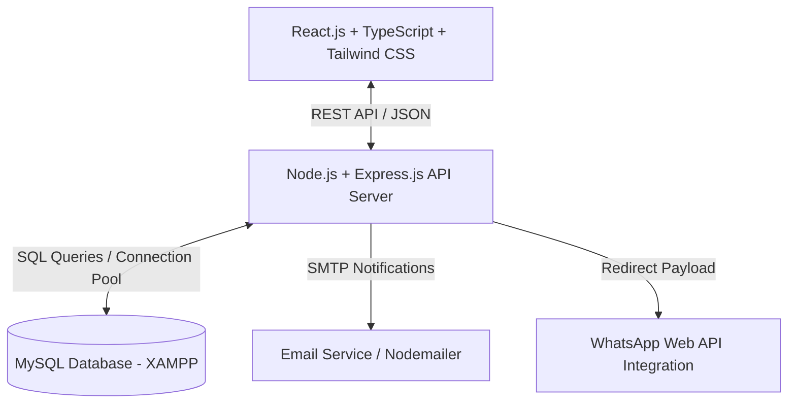
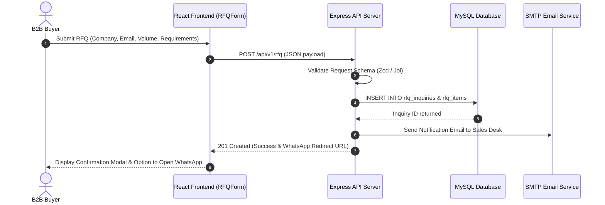

# 02 - System Architecture Document

## 1. High-Level Architecture Overview
**Ghulam Safety Hub** utilizes a decoupled full-stack architecture. The client-side application is built with React.js, TypeScript, and Tailwind CSS. The server-side API is powered by Node.js with Express.js and TypeScript, communicating with a MySQL relational database running via XAMPP.



---

## 2. Layered System Architecture

```text
+-------------------------------------------------------------------------+
|                         Presentation Layer                              |
|               React.js + TypeScript + Tailwind CSS                      |
|  - Components: TopNavBar, HeroBanner, ProductCardGrid, BulkOrderCard   |
|  - Pages: Home, Catalog, ProductDetail, LogisticsRFQ, About, Admin      |
+-------------------------------------------------------------------------+
                                    |
                                    | REST API (HTTP / JSON)
                                    v
+-------------------------------------------------------------------------+
|                        Application API Layer                            |
|                  Node.js + Express.js + TypeScript                      |
|  - Middlewares: AuthGuard, RequestValidator, RateLimiter, ErrorHandler  |
|  - Controllers: ProductController, RFQController, AdminController       |
|  - Services: ProductService, RFQService, EmailNotificationService       |
+-------------------------------------------------------------------------+
                                    |
                                    | SQL / mysql2 Pool
                                    v
+-------------------------------------------------------------------------+
|                         Data Persistence Layer                          |
|                             MySQL (XAMPP)                               |
|  - Tables: users, products, categories, product_images, product_specs,  |
|    product_features, rfq_inquiries, rfq_items, site_settings            |
+-------------------------------------------------------------------------+
```

---

## 3. Core Architectural Modules

### 3.1 Catalog & Product Module
- Manages product metadata, category tree navigation, short description tags (`Precision Handling`, `Heat Protection`), quick specs matrix, and image galleries.
- Provides search and dynamic filter indexing across protection levels, materials, and safety certifications.

### 3.2 B2B RFQ & Inquiry Module
- Captures enterprise quote inquiries via `RFQForm` and product detail order cards.
- Triggers dual notification pipeline:
  1. Internal email notification via Nodemailer / SMTP.
  2. One-click WhatsApp pre-filled message generator.

### 3.3 Admin Portal & Management Module
- JWT-authenticated back-office management routes.
- Admin capabilities: CRUD operations on products, multi-image upload handling, RFQ status updates, site copy edits.

---

## 4. Data Flow Sequence (RFQ Submission Workflow)


