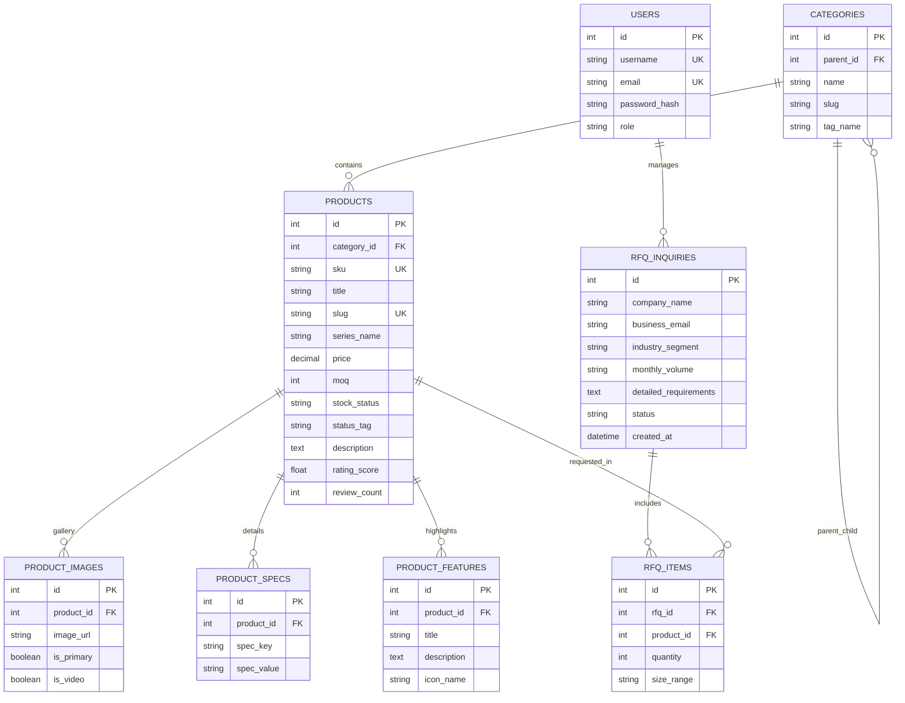

# 08 - Database Schema & ER Diagram

## 1. Overview
The database layer for **Ghulam Safety Hub** uses MySQL (XAMPP environment).

---

## 2. Entity-Relationship (ER) Diagram



---

## 3. SQL DDL Migration Script (MySQL / XAMPP Compatible)

```sql
CREATE DATABASE IF NOT EXISTS ghulam_safety_hub;
USE ghulam_safety_hub;

-- 1. Table: users (Admin authentication)
CREATE TABLE IF NOT EXISTS users (
    id INT AUTO_INCREMENT PRIMARY KEY,
    username VARCHAR(64) UNIQUE NOT NULL,
    email VARCHAR(128) UNIQUE NOT NULL,
    password_hash VARCHAR(255) NOT NULL,
    role VARCHAR(32) DEFAULT 'admin',
    created_at DATETIME DEFAULT CURRENT_TIMESTAMP
) ENGINE=InnoDB DEFAULT CHARSET=utf8mb4;

-- 2. Table: categories
CREATE TABLE IF NOT EXISTS categories (
    id INT AUTO_INCREMENT PRIMARY KEY,
    parent_id INT DEFAULT NULL,
    name VARCHAR(128) NOT NULL,
    slug VARCHAR(128) UNIQUE NOT NULL,
    tag_name VARCHAR(128) NOT NULL,
    FOREIGN KEY (parent_id) REFERENCES categories(id) ON DELETE CASCADE
) ENGINE=InnoDB DEFAULT CHARSET=utf8mb4;

-- 3. Table: products
CREATE TABLE IF NOT EXISTS products (
    id INT AUTO_INCREMENT PRIMARY KEY,
    category_id INT NOT NULL,
    sku VARCHAR(64) UNIQUE NOT NULL,
    title VARCHAR(255) NOT NULL,
    slug VARCHAR(255) UNIQUE NOT NULL,
    series_name VARCHAR(128) DEFAULT 'Heavy Duty Series',
    price DECIMAL(10, 2) NOT NULL DEFAULT 0.00,
    moq INT NOT NULL DEFAULT 50,
    stock_status VARCHAR(32) DEFAULT 'IN STOCK',
    status_tag VARCHAR(64) DEFAULT 'Safety-System-Active',
    description TEXT NOT NULL,
    rating_score DECIMAL(3, 2) DEFAULT 5.00,
    review_count INT DEFAULT 0,
    is_featured BOOLEAN DEFAULT FALSE,
    created_at DATETIME DEFAULT CURRENT_TIMESTAMP,
    FOREIGN KEY (category_id) REFERENCES categories(id) ON DELETE RESTRICT
) ENGINE=InnoDB DEFAULT CHARSET=utf8mb4;

-- 4. Table: product_images
CREATE TABLE IF NOT EXISTS product_images (
    id INT AUTO_INCREMENT PRIMARY KEY,
    product_id INT NOT NULL,
    image_url VARCHAR(512) NOT NULL,
    is_primary BOOLEAN DEFAULT FALSE,
    is_video BOOLEAN DEFAULT FALSE,
    FOREIGN KEY (product_id) REFERENCES products(id) ON DELETE CASCADE
) ENGINE=InnoDB DEFAULT CHARSET=utf8mb4;

-- 5. Table: product_specs
CREATE TABLE IF NOT EXISTS product_specs (
    id INT AUTO_INCREMENT PRIMARY KEY,
    product_id INT NOT NULL,
    spec_key VARCHAR(128) NOT NULL,
    spec_value VARCHAR(255) NOT NULL,
    FOREIGN KEY (product_id) REFERENCES products(id) ON DELETE CASCADE
) ENGINE=InnoDB DEFAULT CHARSET=utf8mb4;

-- 6. Table: product_features
CREATE TABLE IF NOT EXISTS product_features (
    id INT AUTO_INCREMENT PRIMARY KEY,
    product_id INT NOT NULL,
    title VARCHAR(128) NOT NULL,
    description TEXT NOT NULL,
    icon_name VARCHAR(64) NOT NULL,
    FOREIGN KEY (product_id) REFERENCES products(id) ON DELETE CASCADE
) ENGINE=InnoDB DEFAULT CHARSET=utf8mb4;

-- 7. Table: rfq_inquiries
CREATE TABLE IF NOT EXISTS rfq_inquiries (
    id INT AUTO_INCREMENT PRIMARY KEY,
    company_name VARCHAR(128) NOT NULL,
    business_email VARCHAR(128) NOT NULL,
    industry_segment VARCHAR(64) NOT NULL,
    monthly_volume VARCHAR(64) NOT NULL,
    detailed_requirements TEXT NOT NULL,
    status VARCHAR(32) DEFAULT 'pending',
    created_at DATETIME DEFAULT CURRENT_TIMESTAMP
) ENGINE=InnoDB DEFAULT CHARSET=utf8mb4;

-- 8. Table: rfq_items
CREATE TABLE IF NOT EXISTS rfq_items (
    id INT AUTO_INCREMENT PRIMARY KEY,
    rfq_id INT NOT NULL,
    product_id INT NOT NULL,
    quantity INT NOT NULL CHECK (quantity > 0),
    size_range VARCHAR(64) DEFAULT 'Assorted S/M/L/XL',
    FOREIGN KEY (rfq_id) REFERENCES rfq_inquiries(id) ON DELETE CASCADE,
    FOREIGN KEY (product_id) REFERENCES products(id) ON DELETE RESTRICT
) ENGINE=InnoDB DEFAULT CHARSET=utf8mb4;

-- Indexes for Speed Optimization
CREATE INDEX idx_products_category ON products(category_id);
CREATE INDEX idx_products_slug ON products(slug);
CREATE INDEX idx_rfq_email ON rfq_inquiries(business_email);
```
