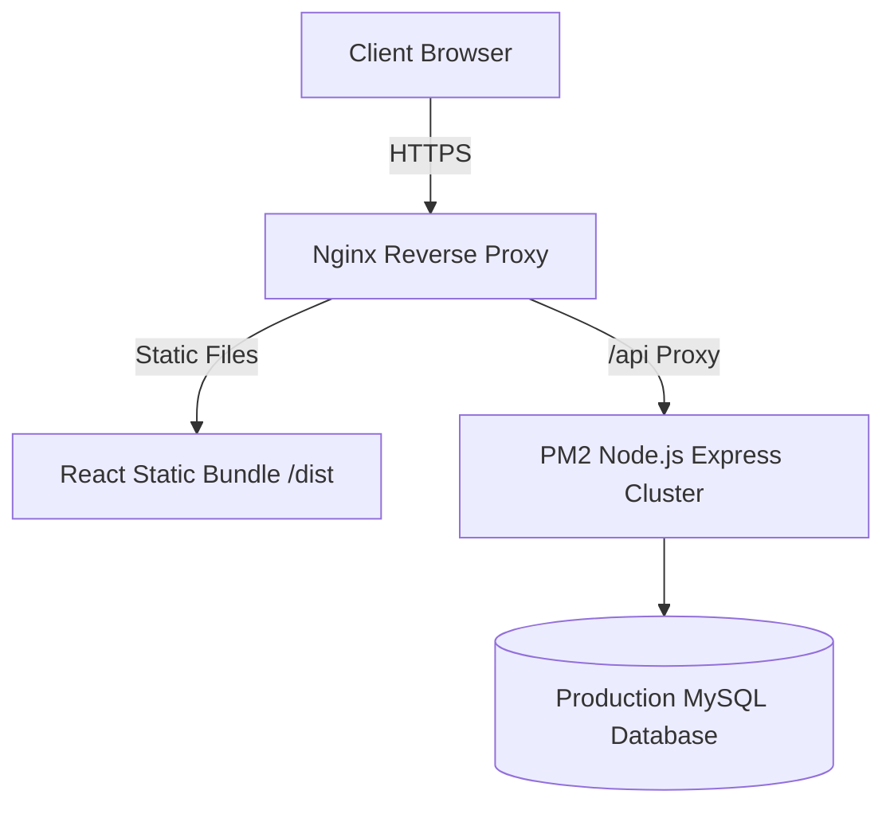

# 10 - Deployment & Environment Configuration

## 1. Development & Local Environment (XAMPP)

### 1.1 Local Requirements
- **Local Web Server & Database**: XAMPP v8.2+ (Apache + MySQL enabled).
- **Node.js**: Node.js v20.x LTS.
- **Package Manager**: `npm` v10.x.

### 1.2 Step-by-Step Local Setup

1. **Database Initialization**:
   - Launch XAMPP Control Panel $\rightarrow$ Start Apache & MySQL.
   - Access `http://localhost/phpmyadmin/`.
   - Create database `ghulam_safety_hub`.
   - Import DDL script from `docs/08-database.md`.

2. **Backend Environment Setup (`backend/.env`)**:
   ```env
   PORT=5000
   NODE_ENV=development
   DB_HOST=127.0.0.1
   DB_PORT=3306
   DB_USER=root
   DB_PASS=
   DB_NAME=ghulam_safety_hub
   JWT_SECRET=ghulam_safety_hub_jwt_super_secret_key_2026
   SMTP_HOST=smtp.gmail.com
   SMTP_PORT=587
   SMTP_USER=bulk@ghulamsafety.com
   SMTP_PASS=app_specific_password_here
   WHATSAPP_PHONE=97145550192
   ```

3. **Frontend Environment Setup (`frontend/.env`)**:
   ```env
   VITE_API_BASE_URL=http://localhost:5000/api/v1
   VITE_WHATSAPP_NUMBER=97145550192
   ```

---

## 2. Production Deployment Plan (VPS / Cloud Infrastructure)



### Production Checklist:
- **HTTPS Enforcement**: Free SSL Certificate via Let's Encrypt / Certbot.
- **Process Management**: Node.js API cluster managed by PM2 (`pm2 start dist/server.js -i max`).
- **Nginx Config**: Reverse proxy forwarding `/api` requests to Express port `5000` and serving React SPA static build (`/dist`).
