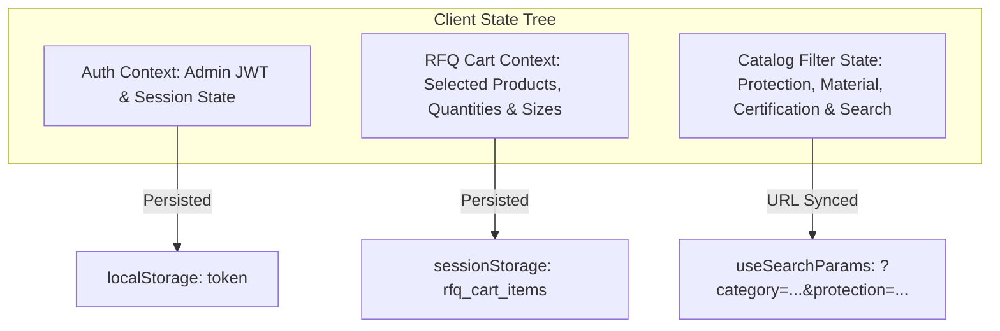

# 12 - State Management & Memory Caching Specification

## 1. Overview
This document specifies client-side state lifetimes (React State / Context), server-side memory connection pooling, and caching strategies for **Ghulam Safety Hub**.

---

## 2. Client-Side State Architecture (React + TypeScript)

### 2.1 State Lifetime Rules
1. **Catalog Filters**: Bound directly to URL Query Parameters (`useSearchParams`) to enable bookmarking and direct link sharing.
2. **RFQ Cart Items**: Persisted in `sessionStorage` so selected items survive page refreshes during inquiry building.
3. **Admin Token**: JWT saved in `localStorage` / HTTP-only Cookie with 24-hour expiration lifetime.

---

## 3. Server-Side Memory Management (Node.js Express)
- **Database Connection Pool**: MySQL connection pool via `mysql2/promise` with limits:
  - `connectionLimit: 10`
  - `queueLimit: 0`
  - `waitForConnections: true`
- **In-Memory Catalog Cache (Optional Optimization)**: Dynamic caching of static category tree in server memory to minimize DB reads.
